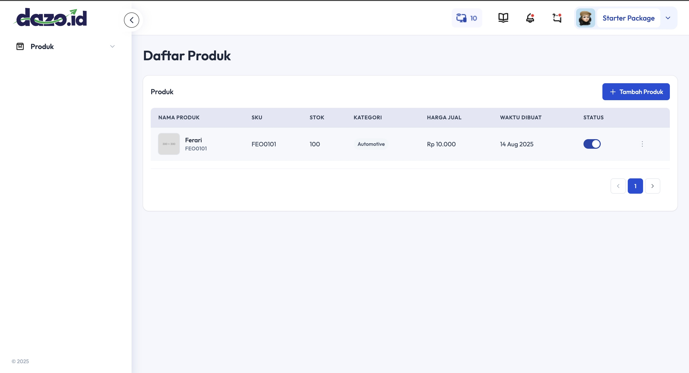
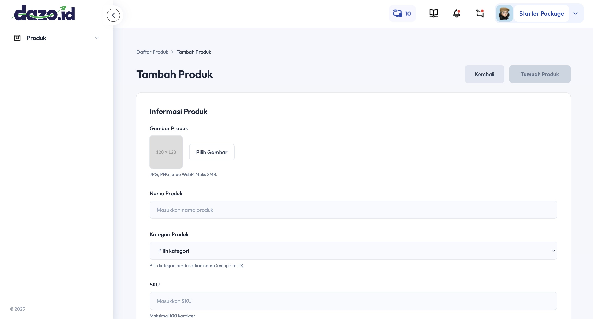
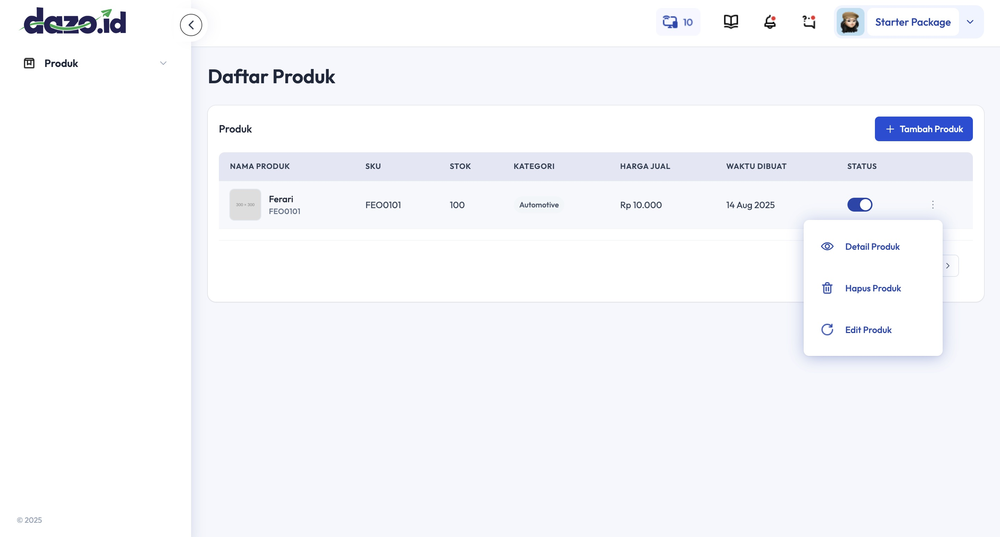
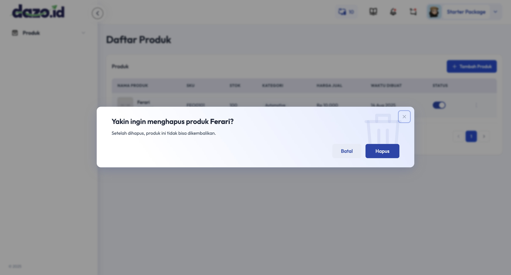
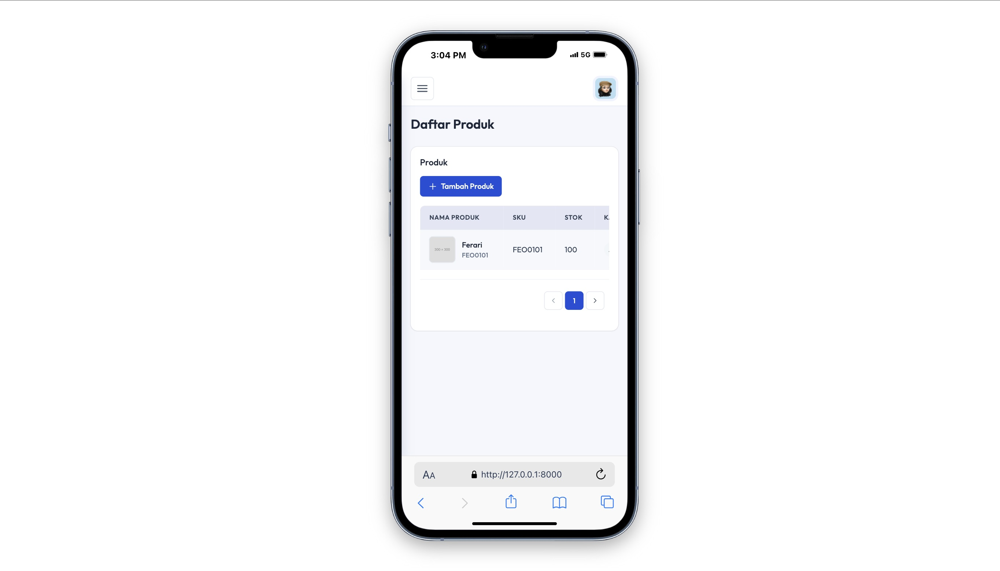
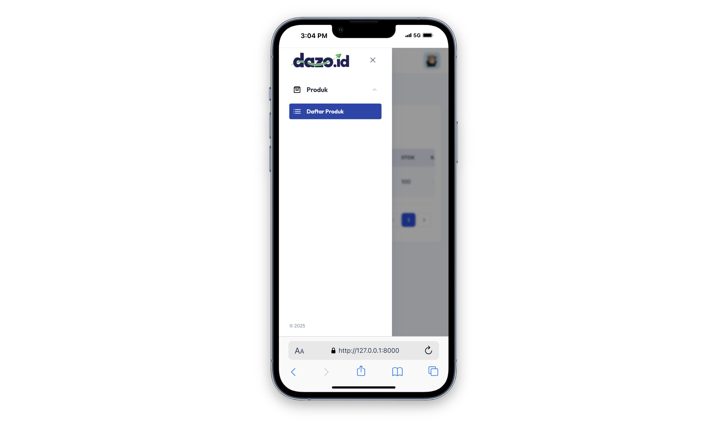

## TES TEKNIKAL SOFTWARE ENGINEER – CRUD Produk (Laravel 11 + Inertia.js + Vue 3 + MongoDB)

## Screenshots

### Halaman Utama



### Halaman Create Produk



### Modal



### Modal Delete Konfirmasi



### Tampilan Mobile



### Sidebar Mobile



## Deskripsi Proyek

Proyek ini mengimplementasikan slicing UI dan fitur CRUD penuh untuk entitas Produk menggunakan Laravel 11 (PHP 8+), Inertia.js, Vue 3, Tailwind CSS, dan MongoDB sebagai database non-relasional.

## Fitur Utama

-   Komponenisasi wajib dan reusable:
    -   Sidebar dan Header sebagai komponen Vue terpisah.
    -   Button, Modal, dan Input dikemas sebagai reusable components.
-   Fitur CRUD Produk end-to-end sesuai desain Figma:
    -   Create, Read (list + detail), Update, Delete.
    -   Inertia.js sebagai jembatan Laravel ↔ Vue.
    -   Validasi di frontend (Vue) dan backend (Laravel validate).
-   Database MongoDB:
    -   Koleksi: `categories` dan `products` (relasi via `category_id`).
    -   Migration untuk skema koleksi.
    -   Seeder untuk kategori awal.
-   Responsif untuk Mobile/Tablet (opsional) dan slicing dengan props/emit (opsional).

## Stack & Requirement

-   Laravel 11.x
-   PHP 8.0+
-   Composer 2.7.x
-   Node.js LTS + npm
-   MongoDB Community Server
-   Paket penting:
    -   inertiajs/inertia-laravel ^2
    -   mongodb/laravel-mongodb ^5.4

## Konfigurasi & Menjalankan (Local)

1. Siapkan environment

-   Salin env dan generate key (opsional untuk dokumentasi)

    ```bash
    cp .env.example .env
    php artisan key:generate
    ```

-   Atur koneksi MongoDB di `.env` (opsional untuk dokumentasi)
    ```env
    DB_CONNECTION=mongodb
    DB_HOST=127.0.0.1
    DB_PORT=27017
    DB_DATABASE=crud_produk
    DB_USERNAME=
    DB_PASSWORD=
    ```

2. Instal dependensi (opsional untuk dokumentasi)

```bash
composer install
npm install
```

3. Build asset & jalankan dev server (opsional untuk dokumentasi)

```bash
npm run dev
php artisan serve
```

4. Storage link untuk upload gambar (opsional untuk dokumentasi)

```bash
php artisan storage:link
```

5. Migration & seeder (opsional untuk dokumentasi)

```bash
php artisan migrate --seed
```

Setelah langkah di atas, akses aplikasi di http://127.0.0.1:8000.
